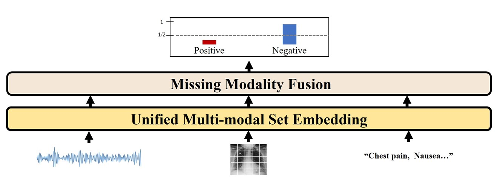

# Learning Missing Modal Electronic Health Records with Unified Multi-modal Data Embedding and Modality-Aware Attention (from AITRICS)

This is the repository for MLHC 2023 Paper ["Learning Missing Modal Electronic Health Records with Unified Multi-modal Data Embedding and Modality-Aware Attention"](https://arxiv.org/abs/2305.02504). 

- If you have used our code or referred to our result in your research, please cite: 
```
@article{lee2023learning,
  title={Learning Missing Modal Electronic Health Records with Unified Multi-modal Data Embedding and Modality-Aware Attention},
  author={Lee, Kwanhyung and Lee, Soojeong and Hahn, Sangchul and Hyun, Heejung and Choi, Edward and Ahn, Byungeun and Lee, Joohyung},
  journal={arXiv preprint arXiv:2305.02504},
  year={2023}
}
```
  
## 


## Requirements
*   [PyTorch 1.8.1+cu102](http://pytorch.org/)

To install all the requirements of this repository in your environment, run:
```
pip install -r requirements.txt
```

## Preprocessing
As the data preprocessing phase of mimicMIMIC-IV + MIMIC-CXR + MIMIC-ED + (MIMIC-IV-Note) is considered our private company resource, the preprocessing code cannot be shared. However, for the convenience of readers, we have made available sample preprocessed data in the data folder, which can be used to reproduce and execute the code.

## Model Training

Check our **builder/models/~** or **builder/models/src/baseline~** repository to see available models. To train the model in default setting, run a command in a format as shown below :  
```
CUDA_VISIBLE_DEVICES=*device number* python ./2_train.py --project-name *folder name to store trained model* --model *name of model to run* --input-types *modalities you want to train* --modality-inclusion *allow missing modality sample or not* --output-type *task*  --vslt-type *UMSE on Time-Series Data*  --imgtxt-time *UMSE on Image and Text Data*
```

For --input-types, we have 4 different modality combaination to train:
1. "vslt": Time-Series Data (Vital-Sign and Lab-Test)
2. "vslt_img": vslt + CXR Image Data
3. "vslt_txt": vslt + Clinical Text Data
4. "vslt_img_txt": vslt + CXR Image Data + Clinical Text Data

Example run for TSA model with UMSE:
```
CUDA_VISIBLE_DEVICES=0 python 2_train.py --project-name github_test_model --input-types vslt_img_txt --model tri_mbt_vsltcls --modality-inclusion train-missing_test-missing --lr-init 1e-5 --output-type intubation --batch-size 64 --epochs 50 --transformer-num-layers 6 --vslt-type TIE --model-types detection --imgtxt-time 1 --mbt-only-vslt 1 --num-workers 16 --multiimages 1
```

Other arguments you can add :
1. multiimages: number of images you want to consider at each prediction
2. realtime: offer time information based on time distance from admission time or time distance from prediction time
3. TIE-len: maximum number of time-series data for each prediction (default: 1000)
Please refer to **/control/config.py** for other arguments and brief explanations. 

## Model Evaluation
```
python ./3_test.py --project-name *folder where model is stored* --model *name of model to test* --output-type *task*
```


 
